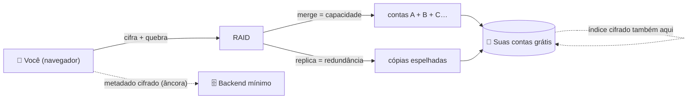
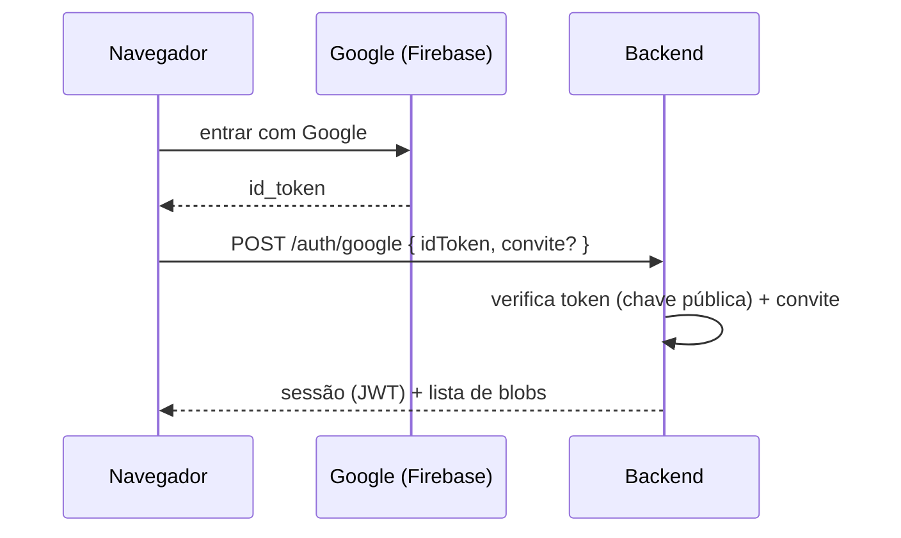
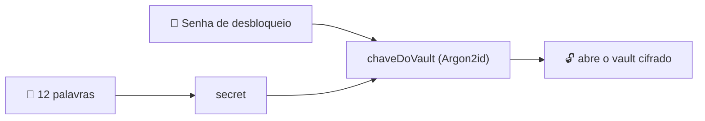
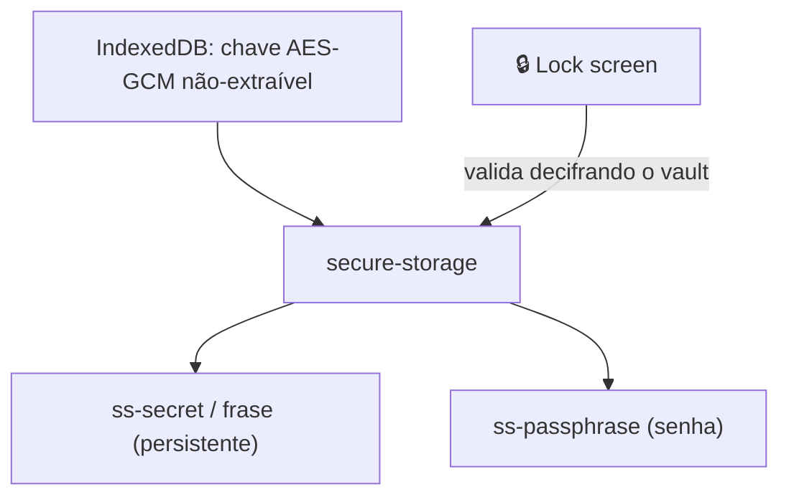
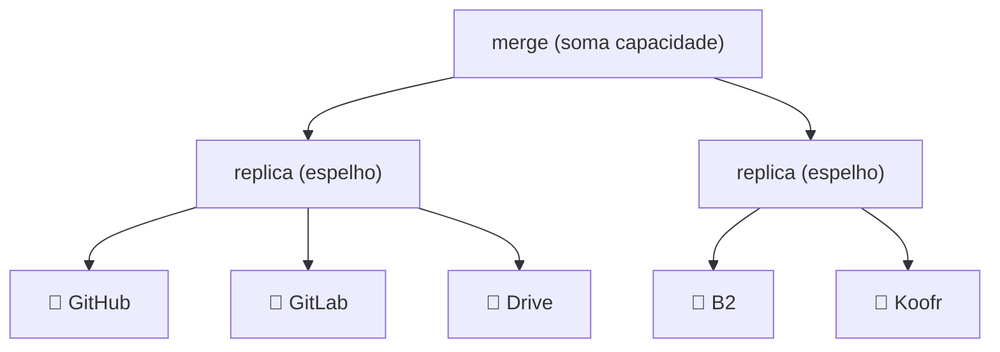
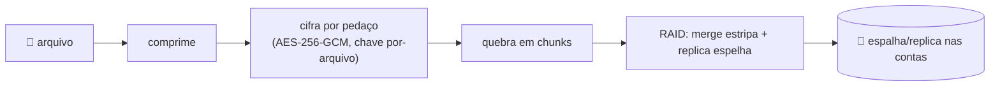
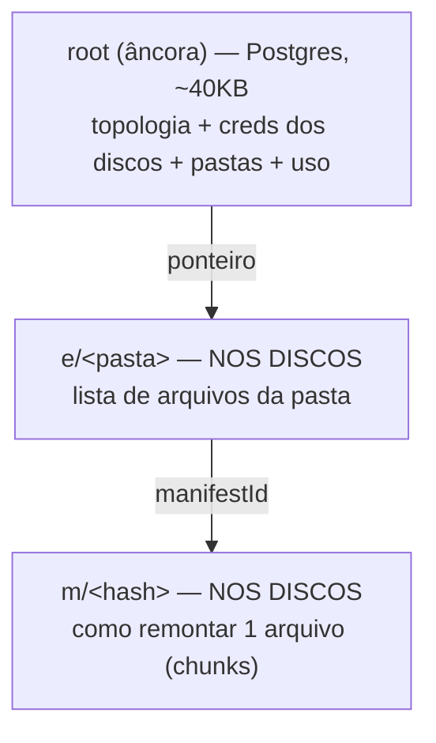
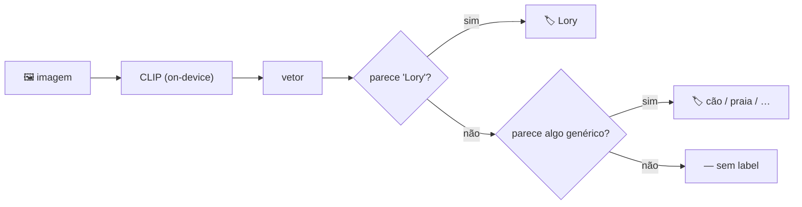

# ShardSphere

### Fragmented. Encrypted. Unified.

Junte várias contas de serviços grátis (GitHub, Google Drive, S3, Dropbox, MEGA, WebDAV…) e transforme em **um disco virtual único, cifrado e 100% seu**. O servidor nunca vê seus arquivos nem suas chaves — tudo acontece no seu navegador.

---

## A ideia

A filosofia é simples: **você já tem gigabytes espalhados em contas grátis** que nunca usa. O ShardSphere costura essas contas numa topologia estilo RAID e as apresenta como **um disco só**.

- **Login** pela sua conta **Google** (nada de senha própria pra decorar).
- Seus arquivos são **cifrados no seu device (2SKD)** e **quebrados em pedaços** espalhados pelas suas contas — nenhuma conta sozinha tem o arquivo inteiro, nem consegue lê-lo.
- **Zero-knowledge:** o servidor guarda só metadado cifrado. Sem suas chaves, é lixo aleatório.

> Você não confia num provedor. Você usa vários — cifrados, redundantes, sob seu controle.

---

## Por que ShardSphere

Não é "mais um cloud". É um jeito diferente de pensar armazenamento:

- 🔐 **Zero-knowledge de verdade.** A chave nasce e morre no seu navegador (2SKD: senha de desbloqueio + frase de 12 palavras). O backend jamais vê arquivo ou chave.
- 🧩 **RAID por cima de contas grátis.** Monte a topologia num **builder visual**: `merge` soma capacidade, `replica` espelha pra redundância. Misture como quiser.
- ♻️ **Self-heal.** Perdeu acesso a uma conta de uma réplica? O sistema reconstrói os pedaços das cópias vivas, sozinho, quando fica ocioso.
- 🗂️ **Escala pra milhões de arquivos.** O índice não vive num JSON gigante: cada pasta é um objeto próprio, carregado sob demanda. Login instantâneo com 6 ou 5.000.000 de arquivos.
- 💽 **O índice mora nos seus discos.** As listas de arquivo e os manifests são cifrados e gravados **nas suas próprias contas** (replicados) — não no backend. Caminho pra rodar **sem backend nenhum**.
- 🖼️ **Labels de imagem por IA, no seu device.** CLIP roda local (nada sai). Crie labels próprios por exemplo ("Lory") — se não reconhece, cai num genérico; se não tem certeza, não rotula.
- 🔗 **Compartilhamento zero-knowledge.** Link temporário, cifrado por-link, sem expor seus discos.
- 🛡️ **2 fatores opt-in.** Senha de desbloqueio (tela) + TOTP (app autenticador), com códigos de emergência e frase de reset.



---

# Como funciona — passo a passo

> Cada bloco: a ideia em uma frase, um desenho, e os **arquivos relacionados**.

## 1. Cadastro & login

Login é **só** pela conta Google (Firebase Authentication). O backend confirma o token do Google e cria/liga a sua conta interna. Primeiro acesso exige um **convite** (single-use) — sistema fechado.



O backend nunca guarda senha — a identidade é do Google; a **cripto** é outra camada, só sua (próximo bloco).

**Arquivos relacionados:** `server · src/auth/*` · `front · core/firebase.ts`, `core/auth/*` · [SHARDSPHERE-FLOWS.md](SHARDSPHERE-FLOWS.md) §2

## 2. Suas chaves (2SKD)

A chave que abre seus arquivos **precisa de dois fatores** e nunca sai do seu device:

```
chaveDoVault = Argon2id( senha_de_desbloqueio , salt = SHA-256(secret) )
secret       = derivado da sua FRASE DE 12 PALAVRAS
```

- **12 palavras** = a raiz. Geradas no onboarding, mostradas 1×, salvas num PDF cifrado. É o que recupera seus dados em outro device.
- **Senha de desbloqueio** = o segundo fator + trava a tela.

Sem os dois, ninguém abre nada — nem você, nem o servidor. Perdeu os dois = zero recuperação (é o preço do zero-knowledge).



**Arquivos relacionados:** `front · core/crypto/vault-key.ts`, `core/recovery-phrase/*` · [SHARDSPHERE-FLOWS.md](SHARDSPHERE-FLOWS.md) §2, §4

## 3. Segurança no navegador

Nada sensível fica em texto puro no navegador. As chaves ficam **cifradas at-rest** com uma chave AES-GCM **não-extraível** guardada no IndexedDB (WebCrypto).

- Ao entrar, a **tela de bloqueio** (PIN/senha de desbloqueio) valida decifrando o vault de verdade — senha errada não passa.
- Ao sair (logout), a sessão limpa; a frase/secret cifrados permanecem no device.



**Arquivos relacionados:** `front · core/secure-storage.ts`, `presenter/components/layout/lock-screen.tsx`

## 4. Dois fatores (2FA / TOTP)

Opcional. Ligou → depois de logar, o sistema pede um código do app autenticador (Google Authenticator, Authy…). Aceita também **código de emergência** (uso único) ou a **frase de reset** (desliga o 2FA). O segredo TOTP e o kit ficam cifrados no backend.

**Arquivos relacionados:** `server · src/twofa/*` · `front · presenter/components/layout/two-factor-gate.tsx`

## 5. Montando os discos (topologia)

Num **builder visual** você arrasta discos (cada um = uma conta grátis) e os agrupa:

- **`replica`** — espelha o mesmo pedaço em todos os discos do grupo → **redundância**.
- **`merge`** — distribui os pedaços entre os grupos → **soma a capacidade**.

Regras: réplica capa no menor disco; um disco não pode estar em dois grupos; ao passar de 80% da cota, o merge desvia pros discos livres.



**Arquivos relacionados:** `front · core/placement.ts`, `core/raid*.ts`, `presenter/components/sidebar/*` · [SHARDSPHERE-FLOWS.md](SHARDSPHERE-FLOWS.md) §7

## 6. Enviando um arquivo

Quando um arquivo chega, tudo acontece **no seu navegador, antes de subir**:



1. Comprime (se ajudar) → cifra → quebra em **chunks** (cada um com um id = hash do conteúdo cifrado).
2. O **merge** manda cada chunk pra um ramo; a **replica** copia em todos os discos do ramo.
3. Nenhuma conta tem o arquivo inteiro. Perder o acesso a uma conta de uma réplica não perde o arquivo.

**Arquivos relacionados:** `front · core/pipeline*.ts`, `core/raid-put.ts`, `core/crypto/*` · [WALKTHROUGH-60MB.md](WALKTHROUGH-60MB.md) *(passo a passo com os JSONs)*

## 7. O índice — onde fica o "mapa"

Pra reconstruir tudo, o ShardSphere guarda metadados cifrados em **3 camadas**:



- **root** (backend): minúsculo, é só o que o login baixa — escala igual com 6 ou 5M arquivos.
- **e/** e **m/** (**nos seus discos**, cifrados, replicados): a lista de cada pasta e os manifests. Abrir uma pasta baixa só ela.

O JSON pesado do índice **saiu do banco** e foi pros discos. O backend só segura a âncora com as credenciais — o mínimo pra bootstrap.

**Arquivos relacionados:** `front · core/folder-store.ts`, `core/manifest-store.ts`, `core/index-driver.ts` · [0001-index-scale.md](0001-index-scale.md)

## 8. Baixar & self-heal

Baixar = ler o manifest (dos discos) → pra cada chunk, o RAID busca em **qualquer cópia viva** do ramo → concatena → decifra → o arquivo original.

Se um disco falhou na escrita, vira um **hint** (fila cifrada e durável); quando o sistema fica ocioso, o **self-heal** copia o pedaço da cópia irmã pro disco que voltou.

**Arquivos relacionados:** `front · core/pipeline-unpack.ts`, `core/heal.ts`, `core/hints.ts`

## 9. Compartilhar

Um link temporário pra quem **não tem conta**. Você re-cifra os arquivos com uma **chave só daquele link**, o backend guarda numa staging (não expõe seus discos), e serve o conteúdo por tempo limitado. Vencido → apagado no próximo acesso.

**Arquivos relacionados:** `server · src/share/*` · `front · components/share-dialog.tsx` · [SHARDSPHERE-FLOWS.md](SHARDSPHERE-FLOWS.md) §25

## 10. Labels de imagem (IA, no seu device)

Opt-in. No upload, o **CLIP** roda no seu navegador (free, nada sai) e gera um vetor da imagem. Você cria labels **por exemplo**: marca 3 fotos da "Lory" → o sistema aprende o protótipo → as próximas fotos ganham "Lory" se baterem; senão um label genérico; senão nada.



**Arquivos relacionados:** `front · ai/*`, `core/labels-store.ts`, `presenter/routes/labels.tsx` · [0002-ai-image-labels.md](0002-ai-image-labels.md)

---

## Repositórios

| Repo | O quê |
|---|---|
| [shardsphere-front-end](https://github.com/Shard-Sphere/shardsphere-front-end) | Cliente (React + Vite) — RAID, cripto, índice, IA, UI. |
| [shardsphere-server-end](https://github.com/Shard-Sphere/shardsphere-server-end) | Backend mínimo (NestJS) — âncora + auth. |
| [.github](https://github.com/Shard-Sphere/.github) | Este — docs de arquitetura. |

## Documentação

- [SHARDSPHERE-FLOWS.md](SHARDSPHERE-FLOWS.md) — cada processo, fluxo a fluxo.
- [WALKTHROUGH-60MB.md](WALKTHROUGH-60MB.md) — passo a passo de um arquivo de 60MB, com os JSONs.
- [0001-index-scale.md](0001-index-scale.md) · [0002-ai-image-labels.md](0002-ai-image-labels.md) — decisões de arquitetura.
- [SHARDSPHERE-PROJECT.md](SHARDSPHERE-PROJECT.md) — tese e decisões.

<sub>🤖 Diagramas em Mermaid (o GitHub renderiza). Prints da UI podem entrar depois.</sub>
